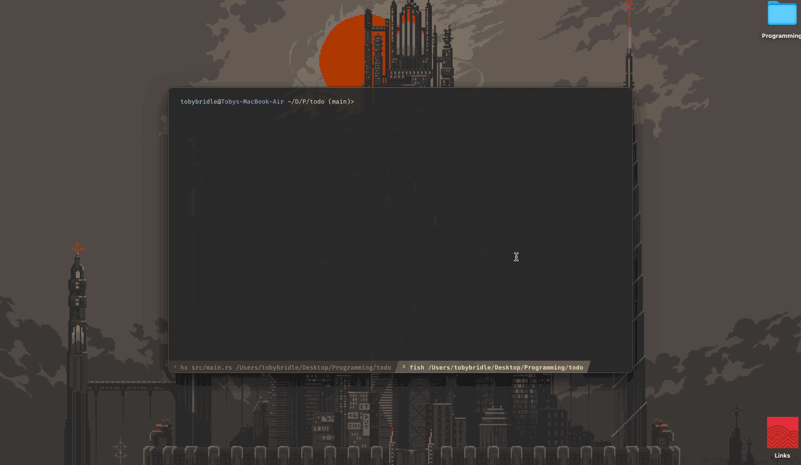

# Todo app built in Rust




**Dependencies**
<br/>
*These will be installed automatically when building*
<br/>

- `ncurses` (Used for creating the TUI)
- `dialoguer` (Used for input handling since the ncurses library didn't provide the desired features)

## Setup

1. [Install Rust](https://www.rust-lang.org/tools/install)
2. Set the environment variable `TODO_FILE_LOCATION` to the file which will store your todos
   (or leave empty and it'll use `~/.local/share/todo/todo.todos`)
3. Build the project

```console
$ cargo build --release
```

4. This will have created a file in `/target/release` called `td`, run that executable and you're good to go!
